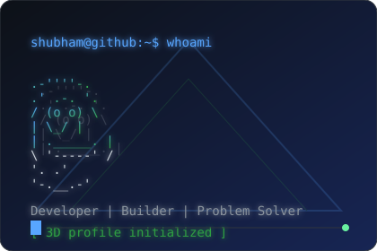
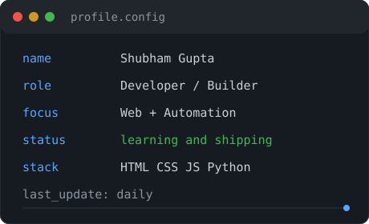
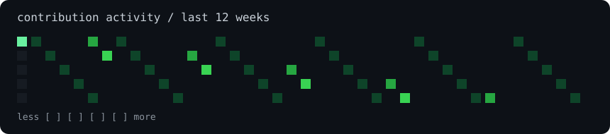

<div align="center">

# SHUBHAM GUPTA

### Developer | Builder | Problem Solver

<table><tr><td valign="top"></td><td valign="top"></td></tr></table>

<p><a href="https://github.com/shubhamgupta002512"></a> <a href="https://github.com/shubhamgupta002512/-portfolio"></a></p>

</div>

## About me

I build clean, practical digital experiences and enjoy learning by shipping: small experiments, polished interfaces, and automation that keeps projects moving.

```text
shubham@github:~$ whoami
Developer focused on web projects, deployment, and continuous learning
shubham@github:~$ status
Building. Learning. Shipping.
```

## What I am working on

- Building modern web projects and developer tooling
- Improving UI polish, accessibility, and responsive layouts
- Learning better architecture, deployment, and automation
- Open to meaningful collaborations and new challenges

## Tech stack

<p></p>

## Featured projects

<table><tr><td width="50%">

### Portfolio deployment

A responsive portfolio website prepared for deployment with a clean frontend structure and focused visual system.

<a href="https://github.com/shubhamgupta002512/-portfolio">View project</a>

</td><td width="50%">

### Contribution automation

A GitHub Actions workflow that refreshes contribution data automatically with safe commit handling.

<a href="https://github.com/shubhamgupta002512/shubhamgupta002512/actions">View workflow</a>

</td></tr></table>

## Contribution activity

<p align="center"></p>

<p align="center"> </p>

<div align="center">

> Keep building. Keep learning. Keep shipping.

</div>
